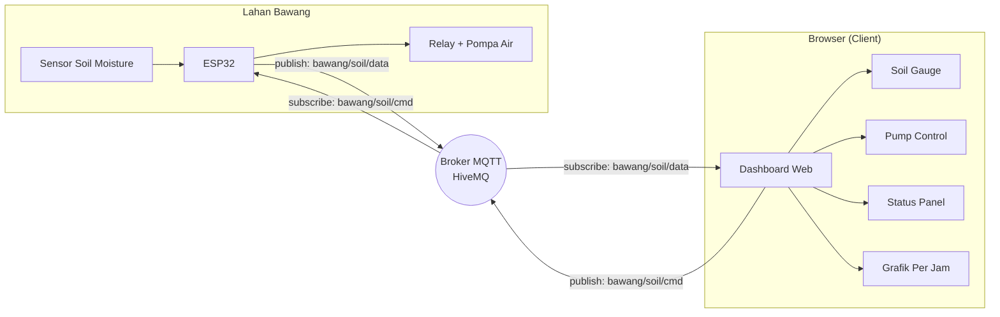
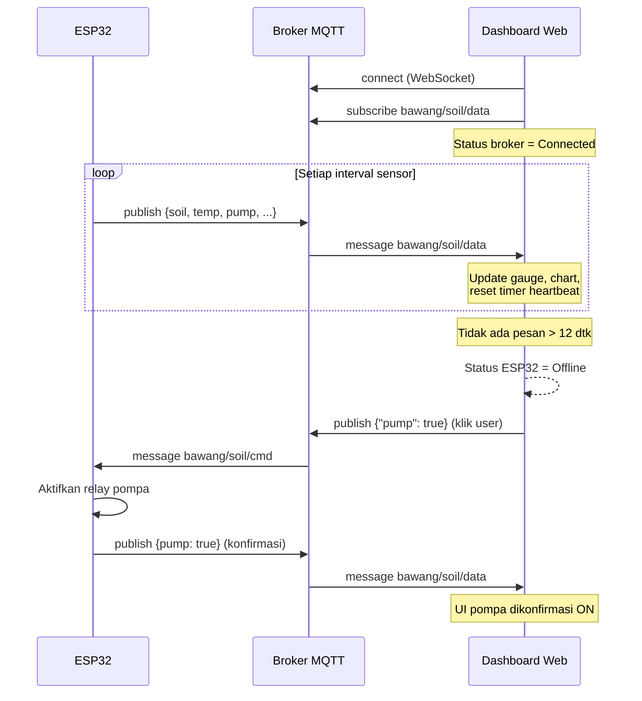
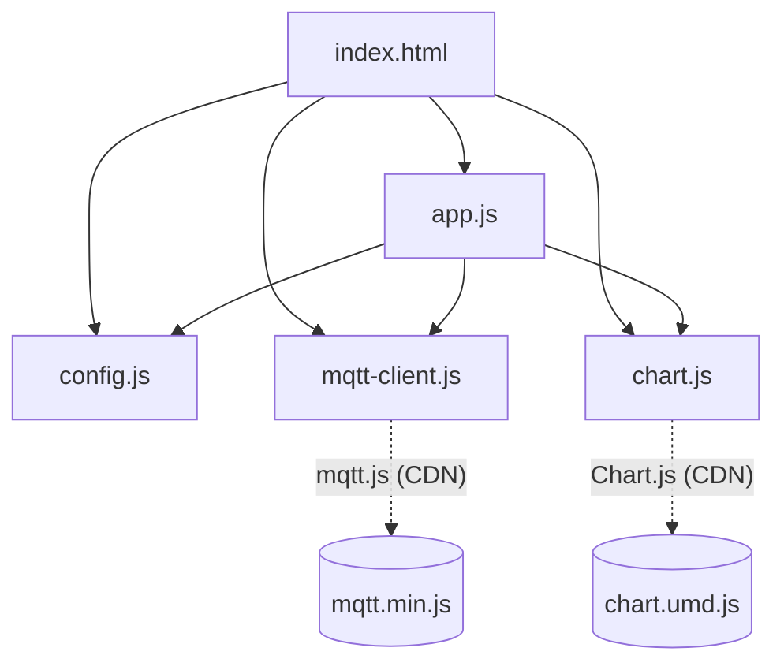
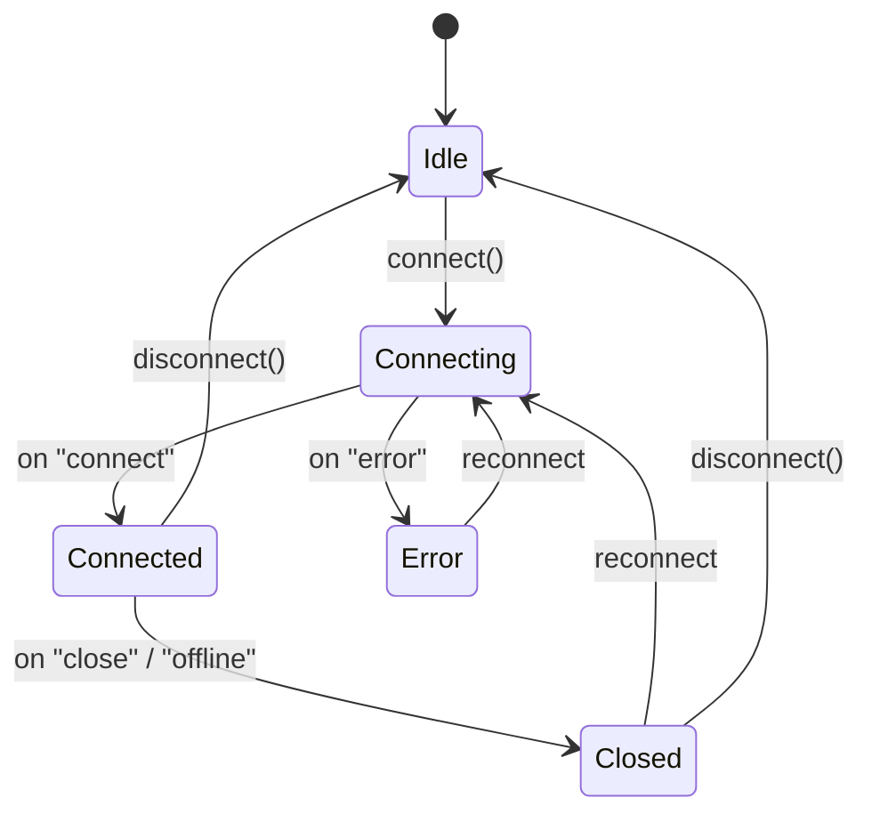

# Monitoring Bawang — Smart Soil & Pump Dashboard

Dashboard web _real-time_ untuk memantau **kelembapan tanah**, mengontrol **relay pompa**, dan menampilkan **status broker MQTT & ESP32** pada sistem irigasi budidaya bawang. Dibangun dengan HTML/CSS/JavaScript murni (tanpa framework/build step) dan terhubung langsung ke broker MQTT melalui **WebSocket**.


---

## Daftar Isi

- [Fitur](#fitur)
- [Arsitektur Sistem](#arsitektur-sistem)
- [Alur Data (Sequence)](#alur-data-sequence)
- [Struktur Folder](#struktur-folder)
- [Format Payload MQTT](#format-payload-mqtt)
- [State Machine Koneksi](#state-machine-koneksi)
- [Menjalankan Proyek](#menjalankan-proyek)
- [Konfigurasi](#konfigurasi)
- [Contoh Firmware ESP32](#contoh-firmware-esp32)
- [Lisensi](#lisensi)

---

## Fitur

| Modul | Deskripsi |
| --- | --- |
| **Soil Gauge** | Gauge melingkar kelembapan tanah (%), nilai raw ADC, dan suhu. Warna berubah otomatis: Kering / Ideal / Basah. |
| **Kontrol Pompa** | Tombol toggle + Turn ON/OFF yang mem-_publish_ perintah JSON ke `commandTopic`. |
| **Status Koneksi** | Indikator _real-time_ status broker MQTT dan status perangkat ESP32 (berdasarkan _heartbeat_). |
| **Tren Per Jam** | Grafik _time-series_ rata-rata kelembapan & suhu per jam (rolling 24 jam). |
| **Pengaturan Broker** | Ubah URL, topik, dan kredensial dari UI; tersimpan di `localStorage`. |
| **Log Aktivitas** | Riwayat event koneksi dan lalu lintas MQTT. |

---

## Arsitektur Sistem



Komunikasi bersifat **dua arah** melalui broker MQTT:

- **Telemetry (naik):** ESP32 → `bawang/soil/data` → Dashboard.
- **Command (turun):** Dashboard → `bawang/soil/cmd` → ESP32.

---

## Alur Data (Sequence)



---

## Struktur Folder

```
monitoring-bawang/
├── index.html          # Struktur halaman & tata letak
├── css/
│   └── style.css        # Tema agritech (dark) + seluruh styling
├── js/
│   ├── config.js        # Default broker, topik, & tunable
│   ├── mqtt-client.js   # Wrapper mqtt.js (connect, subscribe, publish)
│   ├── chart.js         # Agregasi per jam + render Chart.js
│   └── app.js           # Glue: DOM ↔ MQTT ↔ Chart
└── README.md
```

Diagram ketergantungan antar modul:



---

## Format Payload MQTT

Semua telemetry dikirim sebagai **satu payload JSON** pada topik `bawang/soil/data`.

```json
{
  "soil": 42,
  "soilRaw": 2100,
  "temp": 26.5,
  "pump": false,
  "device": "online"
}
```

| Field | Tipe | Keterangan | Alias yang diterima |
| --- | --- | --- | --- |
| `soil` | number | Kelembapan tanah (%) | `moisture`, `humidity` |
| `soilRaw` | number | Nilai mentah ADC | `raw`, `adc` |
| `temp` | number | Suhu (°C) | `temperature` |
| `pump` | boolean | Status relay pompa | `relay`, `pump_state` |
| `device` | string | Status perangkat | `status` |

Perintah kontrol pompa dikirim ke `bawang/soil/cmd`:

```json
{ "pump": true }
```

---

## State Machine Koneksi



Status **ESP32** dihitung terpisah dari status broker menggunakan _heartbeat_: setiap pesan masuk me-_reset_ timer `deviceTimeout` (default **12 detik**). Jika tak ada pesan dalam rentang itu, perangkat ditandai **Offline**.

---

## Menjalankan Proyek

Karena murni statis, cukup jalankan sebuah _static server_ dari dalam folder:

```bash
# Opsi 1 — Python
cd monitoring-bawang
python3 -m http.server 5500

# Opsi 2 — Node (serve)
npx serve monitoring-bawang

# Opsi 3 — VS Code
# Klik kanan index.html → "Open with Live Server"
```

Lalu buka `http://localhost:5500`. Dashboard akan otomatis mencoba terhubung ke broker default (HiveMQ).

> **Catatan:** Buka lewat `http://` / `https://` (bukan `file://`) agar koneksi WebSocket ke broker berfungsi. Bila situs di-_host_ via HTTPS, gunakan broker `wss://` (bukan `ws://`) untuk menghindari _mixed-content blocking_.

---

## Konfigurasi

Nilai default ada di [`js/config.js`](js/config.js). Semua bisa ditimpa dari UI **Pengaturan Broker** dan disimpan di `localStorage`.

| Kunci | Default | Keterangan |
| --- | --- | --- |
| `url` | `wss://broker.hivemq.com:8884/mqtt` | Endpoint broker (WebSocket) |
| `dataTopic` | `bawang/soil/data` | Topik telemetry masuk |
| `commandTopic` | `bawang/soil/cmd` | Topik perintah keluar |
| `deviceTimeout` | `12000` | Ambang _offline_ ESP32 (ms) |
| `historyHours` | `24` | Jendela retensi grafik (jam) |
| `logLimit` | `60` | Maks. baris log |

---

## Contoh Firmware ESP32

Cuplikan Arduino (PubSubClient) yang kompatibel dengan payload di atas:

```cpp
#include <WiFi.h>
#include <PubSubClient.h>
#include <ArduinoJson.h>

const char* DATA_TOPIC = "bawang/soil/data";
const char* CMD_TOPIC  = "bawang/soil/cmd";
const int   PUMP_PIN   = 26;

WiFiClient net;
PubSubClient client(net);

void onMessage(char* topic, byte* payload, unsigned int len) {
  StaticJsonDocument<128> doc;
  deserializeJson(doc, payload, len);
  bool pump = doc["pump"] | false;
  digitalWrite(PUMP_PIN, pump ? HIGH : LOW);
}

void publishTelemetry() {
  int raw = analogRead(34);
  int pct = map(raw, 4095, 1200, 0, 100);   // kalibrasi sesuai sensor
  StaticJsonDocument<192> doc;
  doc["soil"]    = constrain(pct, 0, 100);
  doc["soilRaw"] = raw;
  doc["temp"]    = 26.5;                     // ganti dengan sensor suhu
  doc["pump"]    = digitalRead(PUMP_PIN);
  doc["device"]  = "online";
  char buf[192];
  serializeJson(doc, buf);
  client.publish(DATA_TOPIC, buf);
}
```

> Broker WebSocket dipakai oleh **web**; ESP32 umumnya terhubung ke broker yang sama lewat **TCP MQTT** biasa (mis. `broker.hivemq.com:1883`). Keduanya bertemu di broker.

---

## Lisensi

MIT — bebas digunakan dan dimodifikasi untuk keperluan riset maupun produksi.
