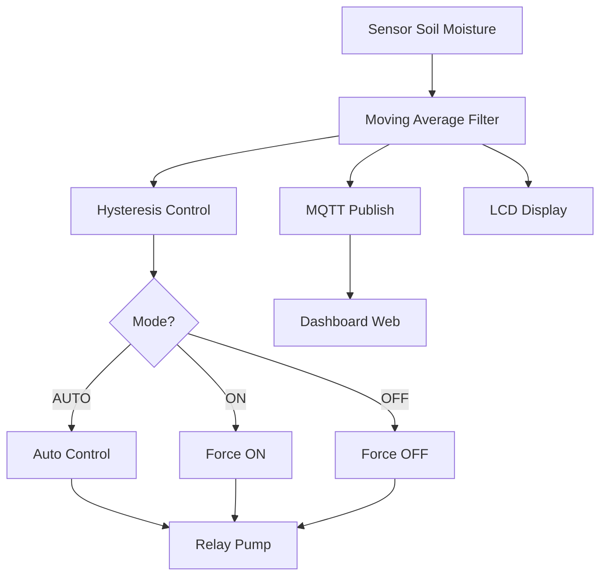
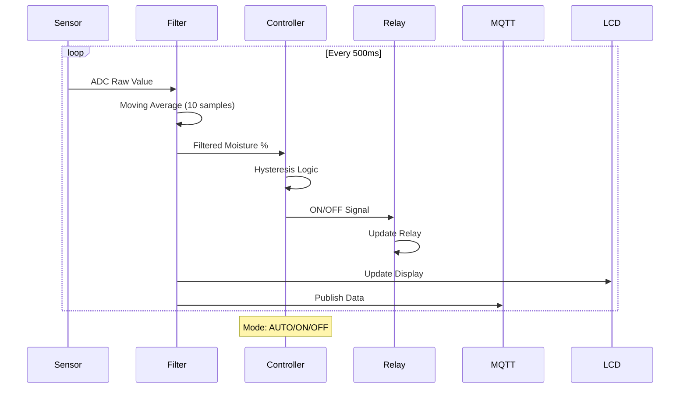

# 🌱 Hydroponic Habib - ESP32 Soil Moisture Monitoring

<p align="center">
  <em>Sistem Monitoring dan Kontrol Kelembaban Tanah berbasis ESP32 dengan MQTT, Moving Average Filter, dan Hysteresis Control</em>
</p>

<p align="center">
  <!-- Status Badges -->
  
  
  
  
  
  
  
  <a href="LICENSE">
    
  </a>
</p>

<p align="center">
  
  
  
  
  
</p>

<p align="center">
  <a href="#-overview">Overview</a> •
  <a href="#-features">Features</a> •
  <a href="#-system-architecture">Architecture</a> •
  <a href="#-pin-configuration">Pin Configuration</a> •
  <a href="#-installation">Installation</a> •
  <a href="#-usage">Usage</a> •
  <a href="#-control-algorithm">Control Algorithm</a>
</p>

---

## 📑 Table of Contents

- [✨ Overview](#-overview)
- [🎯 Features](#-features)
- [🏗️ System Architecture](#️-system-architecture)
- [🔌 Pin Configuration](#-pin-configuration)
- [📡 MQTT Topics](#-mqtt-topics)
- [🧠 Control Algorithm](#-control-algorithm)
- [⚙️ Installation](#️-installation)
- [🚀 Usage](#-usage)
- [📱 Dashboard](#-dashboard)
- [🐞 Troubleshooting](#-troubleshooting)
- [🤝 Contributing](#-contributing)
- [📄 License](#-license)

---

## ✨ Overview

**Hydroponic Habib** adalah sistem monitoring dan kontrol kelembaban tanah berbasis **ESP32** yang dirancang untuk sistem hidroponik dan pertanian pintar. Sistem ini membaca kelembaban tanah menggunakan sensor kapasitif, memproses data dengan **Moving Average Filter**, mengontrol pompa air menggunakan **Hysteresis Control**, dan mengirimkan data ke **dashboard web** melalui **MQTT**.

### 🎯 Cara Kerja

1. **ESP32 membaca sensor** → ADC dari sensor kelembaban tanah (GPIO 35)
2. **Moving Average Filter** → Menstabilkan data dari 10 sampel terakhir
3. **Hysteresis Control** → Menentukan ON/OFF pompa dengan zona mati (25-45%)
4. **Kontrol Relay** → Mengaktifkan/mematikan pompa (GPIO 14)
5. **MQTT Publish** → Mengirim data ke broker HiveMQ
6. **LCD Display** → Menampilkan status secara real-time

### 📊 Flowchart Sistem



---

## 🎯 Features

### ✅ Core Features

- **Real-time Soil Moisture Monitoring**  
  Membaca kelembaban tanah dengan sensor kapasitif

- **Moving Average Filter**  
  Menstabilkan data sensor dari noise dengan rata-rata 10 sampel

- **Hysteresis Control**  
  Mencegah relay ON/OFF cepat dengan zona mati 25-45%

- **3 Mode Operasi**  
  - **AUTO**: Kontrol otomatis berdasarkan kelembaban
  - **ON**: Pompa paksa menyala
  - **OFF**: Pompa paksa mati

- **MQTT Integration**  
  Mengirim data ke broker HiveMQ untuk dashboard monitoring

- **LCD 16x2 Display**  
  Menampilkan kelembaban, status pompa, dan mode operasi

- **Telemetry Data**  
  Mengirim data lengkap dalam format JSON

### 🔧 Technical Features

| Feature | Detail |
|---------|--------|
| **Microcontroller** | ESP32 DevKit |
| **Sensor** | Capacitive Soil Moisture Sensor |
| **Actuator** | Relay Module (Active LOW) |
| **Display** | LCD 16x2 I2C (0x27) |
| **Protocol** | MQTT over TCP |
| **Broker** | HiveMQ Public Broker |
| **Filter** | Moving Average (10 samples) |
| **Controller** | Hysteresis Control |
| **Data Rate** | 2 detik per publish |
| **Baud Rate** | 115200 |

---

## 🏗️ System Architecture

### 🔗 Diagram Sistem

```
┌─────────────────────────────────────────────────────────────────┐
│                         ESP32 HYDROPONIC SYSTEM                 │
├─────────────────────────────────────────────────────────────────┤
│                                                                 │
│  ┌──────────────┐    ┌──────────────┐    ┌──────────────┐       │
│  │   Sensor     │    │   Moving     │    │  Hysteresis  │       │
│  │   Soil       │──▶│   Average    │───▶│   Control    │       │
│  │   (GPIO 35)  │    │   (10 sampel)│    │   (25-45%)   │       │
│  └──────────────┘    └──────────────┘    └──────┬───────┘       │
│                                                 │               │
│                                                 ▼               │
│                                    ┌─────────────────────┐      │
│                                    │   Relay Pump        │      │
│                                    │   (GPIO 14)         │      │
│                                    └─────────────────────┘      │
│                                                  │              │
│                                                  ▼              │
│  ┌──────────────┐    ┌──────────────┐    ┌──────────────┐       │
│  │   MQTT       │    │   LCD 16x2   │    │   Serial     │       │
│  │   Publish    │    │   Display    │    │   Monitor    │       │
│  └──────────────┘    └──────────────┘    └──────────────┘       │
│                                                                 │
└─────────────────────────────────────────────────────────────────┘
                               │
                               │ MQTT
                               ▼
                    ┌─────────────────────┐
                    │   HiveMQ Broker     │
                    │   broker.hivemq.com │
                    │   Port: 1883        │
                    └─────────────────────┘
                               │
                               │ WebSocket
                               ▼
                    ┌─────────────────────┐
                    │   Dashboard Web     │
                    │   (GitHub Pages)    │
                    └─────────────────────┘
```

### 📊 Data Flow



---

## 🔌 Pin Configuration

### ESP32 GPIO Mapping

```
                        +-------------------------------+
        VIN 5V -------->| VIN                           |
        GND ----------->| GND                           |
                        |                               |
   Soil Sensor -------->| GPIO35  (ADC1)    ESP32       |
   (SIG)                |                   DevKit      |
                        |                               |
                        |  I2C:  SDA=GPIO21  SCL=GPIO22 |----> LCD 16x2 (0x27)
                        |                               |
                        |  GPIO14 ---> [Relay] ---> Pompa Air
                        +-------------------------------+
                                     |
                                     | WiFi + MQTT
                                     v
                        +-------------------------------+
                        |   Broker HiveMQ (Public)      |
                        |   broker.hivemq.com:1883      |
                        +-------------------------------+
                                     |
                                     | WebSocket
                                     v
                        +-------------------------------+
                        |   Dashboard (Browser)         |
                        +-------------------------------+
```

### Pin Table

| Komponen | GPIO | Keterangan |
|----------|------|------------|
| **Sensor Soil** | 35 | ADC1 Input Only |
| **Relay Pompa** | 14 | Active LOW |
| **I2C SDA** | 21 | LCD |
| **I2C SCL** | 22 | LCD |
| **VCC** | 5V | Power sensor & LCD |
| **GND** | GND | Ground |

### Wiring Notes

```
⚠️ PENTING:
1. Sensor soil menggunakan VCC 5V dan GND
2. Relay module aktif-LOW (sinyal LOW = relay ON)
3. Sambungkan GND bersama (common ground)
4. GPIO34 & GPIO35 adalah Input Only
5. LCD I2C address: 0x27 (bisa berbeda)
```

---

## 📡 MQTT Topics

### Topic Structure

```text
Base: hydroponic/habib/
├── sensor/
│   ├── soil        → Nilai ADC (int)
│   ├── moisture    → Kelembaban filtered (float)
│   └── all         → JSON lengkap semua data
├── control/
│   └── relay       → ON/OFF/AUTO
└── status/
    ├── relay       → ON/OFF
    └── device      → online/offline
```

### Topic Details

| Arah | Topik | Payload Contoh |
|------|-------|----------------|
| **ESP32 → Dashboard** | | |
| ESP32 → Dash | `hydroponic/habib/sensor/soil` | `1425` |
| ESP32 → Dash | `hydroponic/habib/sensor/moisture` | `100.0` |
| ESP32 → Dash | `hydroponic/habib/sensor/all` | `{"adc":1425,"moisture":100,"filtered":100.0,"status":"BASAH","relay":"OFF","mode":"AUTO"}` |
| ESP32 → Dash | `hydroponic/habib/status/relay` | `ON` / `OFF` |
| ESP32 → Dash | `hydroponic/habib/status/device` | `online` / `offline` |
| **Dashboard → ESP32** | | |
| Dash → ESP32 | `hydroponic/habib/control/relay` | `ON` / `OFF` / `AUTO` |

### JSON Payload Format

```json
{
  "adc": 1425,              // Raw ADC value (0-4095)
  "moisture": 100,          // Raw moisture %
  "filtered": 100.0,        // Filtered moisture % (moving average)
  "status": "BASAH",        // KERING / NORMAL / BASAH
  "relay": "OFF",           // ON / OFF
  "mode": "AUTO"            // AUTO / ON / OFF
}
```

---

## 🧠 Control Algorithm

### 1. Moving Average Filter

Mengambil rata-rata dari 10 sampel ADC terakhir untuk mengurangi noise:

```cpp
float movingAverageFilter(int newAdc) {
  adcBuffer[bufferIndex] = newAdc;
  bufferIndex = (bufferIndex + 1) % MOVING_AVERAGE_SIZE;
  
  long sum = 0;
  for (int i = 0; i < bufferCount; i++) {
    sum += adcBuffer[i];
  }
  return (float)sum / bufferCount;
}
```

**Manfaat:**
- Mengurangi noise sensor
- Menstabilkan pembacaan
- Mencegah trigger palsu

### 2. Hysteresis Control

Mencegah relay ON/OFF cepat dengan zona mati (deadband):

```
Pompa ON  ←─── KERING ───┤  ZONA MATI  ├─── BASAH ───→  Pompa OFF
                          25%           45%
                         (ON)          (OFF)
```

```cpp
bool hysteresisControl(float moisture, bool currentState) {
  if (moisture <= HYSTERESIS_ON) {   // 25%
    return true;   // KERING → Pompa ON
  } else if (moisture >= HYSTERESIS_OFF) {  // 45%
    return false;  // BASAH → Pompa OFF
  } else {
    return currentState;  // Zona mati, pertahankan kondisi
  }
}
```

**Keunggulan:**
- Mencegah chattering relay
- Memperpanjang umur relay
- Kontrol lebih stabil

### 3. Finite State Machine

3 mode operasi:

```
        ┌─────────────────────────────────────┐
        │                                     │
        ▼                                     │
┌───────────────┐                    ┌───────────────┐
│    AUTO       │                    │     ON        │
│  (Otomatis)   │                    │  (Force ON)   │
└───────┬───────┘                    └───────┬───────┘
        │                                    │
        │                                    │
        └──────────────┬─────────────────────┘
                       │
                       ▼
              ┌───────────────┐
              │     OFF       │
              │  (Force OFF)  │
              └───────────────┘
```

### 4. Kalibrasi Sensor

```cpp
#define ADC_DRY 4095   // Nilai ADC saat tanah kering
#define ADC_WET 1700   // Nilai ADC saat tanah basah

// Konversi ADC ke persentase
int moisture = map(adcValue, ADC_DRY, ADC_WET, 0, 100);
```

---

## ⚙️ Installation

### 1. Hardware Requirements

| Komponen | Jumlah | Keterangan |
|----------|--------|------------|
| ESP32 DevKit | 1 | Board utama |
| Capacitive Soil Moisture Sensor | 1 | Sensor kelembaban |
| Relay Module | 1 | Active LOW |
| LCD 16x2 I2C | 1 | Display |
| Kabel Jumper | 10+ | Koneksi |
| Power Supply 5V | 1 | Power |
| Pompa Air | 1 | Aktuator |

### 2. Software Requirements

- **Arduino IDE** (v2.0+)
- **Library yang diperlukan:**

```cpp
// Install via Library Manager
#include <WiFi.h>          // Built-in
#include <PubSubClient.h>  // Nick O'Leary
#include <Wire.h>          // Built-in
#include <LiquidCrystal_I2C.h>  // Frank de Brabander
```

### 3. Install Libraries

**Cara 1: Library Manager**
1. Buka Arduino IDE
2. Sketch → Include Library → Manage Libraries...
3. Cari dan install:
   - `PubSubClient` by Nick O'Leary
   - `LiquidCrystal I2C` by Frank de Brabander

**Cara 2: Manual**
```bash
cd ~/Arduino/libraries/
git clone https://github.com/knolleary/pubsubclient
git clone https://github.com/fdebrabander/Arduino-LiquidCrystal-I2C-library
```

### 4. Upload Kode

1. Buka file `esp32_soil_moisture.ino`
2. Sesuaikan konfigurasi:
   ```cpp
   const char* WIFI_SSID = "your_wifi_ssid";
   const char* WIFI_PASSWORD = "your_wifi_password";
   ```
3. Pilih Board: **ESP32 Dev Module**
4. Pilih Port: **COMx (ESP32)**
5. Upload (Ctrl+U)

### 5. Wiring Diagram

```
┌─────────────────────────────────────────────────────────────────┐
│                         ESP32 DevKit                            │
├─────────────────────────────────────────────────────────────────┤
│                                                                 │
│  3.3V ────► Sensor VCC                                          │
│  GND  ────► Sensor GND                                          │
│  GPIO35──► Sensor SIG                                           │
│                                                                 │
│  5V   ────► LCD VCC                                             │
│  GND  ────► LCD GND                                             │
│  GPIO21──► LCD SDA                                              │
│  GPIO22──► LCD SCL                                              │
│                                                                 │
│  5V   ────► Relay VCC                                           │
│  GND  ────► Relay GND                                           │
│  GPIO14──► Relay IN                                             │
│                                                                 │
│  Relay NO ────► Pompa (+)                                       │
│  Relay COM───► Power Supply (+)                                 │
│  Power GND ────► Pompa (-)                                      │
│                                                                 │
└─────────────────────────────────────────────────────────────────┘
```

---

## 🚀 Usage

### Step-by-Step Operation

1. **⚡ Power On ESP32**
   - ESP32 akan boot dan menampilkan splash screen
   - Terhubung ke WiFi
   - Terhubung ke MQTT broker

2. **📊 Monitor Data**
   - Lihat LCD untuk status real-time
   - Buka Serial Monitor (115200 baud)
   - Data ditampilkan setiap 2 detik

3. **🎯 Kontrol Mode**
   - **AUTO**: Kontrol otomatis (default)
   - **ON**: Pompa paksa menyala
   - **OFF**: Pompa paksa mati

4. **📡 Dashboard Web**
   - Buka dashboard web
   - Lihat data real-time
   - Kontrol pompa dari jarak jauh

### Serial Monitor Output

```
==========================================
    HYDROPONIC SYSTEM
==========================================
Hardware:
  Soil      : GPIO 35
  Relay     : GPIO 14
  LCD       : I2C 0x27

Control Algorithm:
  [1] Moving Average Filter  : 10 samples
  [2] Hysteresis Control     : ON=25%, OFF=45%
  [3] Finite State Machine   : AUTO / ON / OFF
==========================================

[WiFi] Connected!
[WiFi] IP: 10.10.0.2
[MQTT] Connected!

ADC: 1425 | Moisture: 100.0% | Status: BASAH | Relay: OFF | Mode: AUTO
[MQTT] Data published
  JSON: {"adc":1425,"moisture":100,"filtered":100.0,"status":"BASAH","relay":"OFF","mode":"AUTO"}
```

### LCD Display

```
┌────────────────────────────────┐
│ Mois:100.0%                    │
│ BASAH  P:OFF A                 │
└────────────────────────────────┘
```

**Keterangan:**
- Baris 1: Kelembaban filtered
- Baris 2: Status | Pump | Mode
  - Mode: `A` (AUTO), `M` (Manual ON), `F` (Force OFF)

---

## 📱 Dashboard

### Web Dashboard Features

- **Real-time Monitoring**: pH, TDS, Suhu, Kelembaban
- **Gauge Display**: Visual kelembaban
- **Trend Chart**: 24-hour history
- **Pump Control**: ON/OFF/AUTO
- **Activity Log**: Event history
- **MQTT Status**: Koneksi broker

### Dashboard Preview

```
┌────────────────────────────────────────────────────────────────────────┐
│ 🌱 Hydroponic Habib                      ESP32 ● ONLINE   22:41:32     │
│ Smart Monitoring & Control               MQTT ● CONNECTED              │
├────────────────────────────────────────────────────────────────────────┤
│                                                                        │
│  ┌─────────────┐  ┌─────────────┐  ┌─────────────┐  ┌─────────────┐    │
│  │  Kelembaban │  │     ADC     │  │   Status    │  │   Control   │    │
│  │   100.0%    │  │   1425      │  │   BASAH     │  │   [AUTO]    │    │
│  │   BASAH     │  │             │  │   NORMAL    │  │  [ON] [OFF] │    │
│  └─────────────┘  └─────────────┘  └─────────────┘  └─────────────┘    │
│                                                                        │
│  ┌────────────────────────────────────────────────────────────────┐    │
│  │  📊 Trend Chart (24 Hours)                                     │   │
│  │  ┌───────────────────────────────────────────────────────────┐ │    │
│  │  │  100 ┤                                                    │ │    │
│  │  │   80 ┤                                                    │ │    │
│  │  │   60 ┤                                                    │ │    │
│  │  │   45 ┤─────────────────── OFF Threshold                   │ │    │
│  │  │   25 ┤─────────────────── ON Threshold                    │ │    │
│  │  │    0 └─────────────────────────────────────────────────── │ │    │
│  │  │      22:00   22:10   22:20   22:30   22:40                │ │    │
│  │  └───────────────────────────────────────────────────────────┘ │    │
│  └────────────────────────────────────────────────────────────────┘    │
│                                                                        │
├────────────────────────────────────────────────────────────────────────┤
│  📝 Event Log                                                         │
│  22:38:21  Soil 25% → Pump ON                                          │
│  22:40:12  Soil 45% → Pump OFF                                         │
│  22:41:02  MQTT connected                                              │
└────────────────────────────────────────────────────────────────────────┘
```

### Dashboard Repository

Dashboard terpisah di repository: [hydroponic-dashboard](https://github.com/your-username/hydroponic-dashboard)

---

## 🐞 Troubleshooting

### ❌ Common Issues & Solutions

#### **ESP32 Tidak Terhubung WiFi**

```cpp
// Check di Serial Monitor
[WiFi] Connecting...
.....
[WiFi] Failed to connect!
```

**Solution:**
- ✅ Periksa SSID dan password
- ✅ Pastikan WiFi 2.4GHz
- ✅ Cek jarak ESP32 ke router
- ✅ Restart router

#### **MQTT Connection Failed**

```cpp
[MQTT] Failed, state: -2
```

**Solution:**
- ✅ Periksa koneksi internet
- ✅ Pastikan broker online
- ✅ Cek firewall
- ✅ Ganti broker jika perlu

#### **Sensor Membaca 0 atau 4095**

**Solution:**
- ✅ Periksa kabel sensor
- ✅ Pastikan VCC 5V
- ✅ Cek koneksi GND
- ✅ Kalibrasi ulang

#### **Relay Tidak Bekerja**

**Solution:**
- ✅ Periksa kabel relay
- ✅ Pastikan relay active LOW
- ✅ Cek power supply pompa
- ✅ Test relay dengan LED

#### **LCD Tidak Menampilkan**

**Solution:**
- ✅ Periksa koneksi I2C
- ✅ Cek address LCD (0x27 atau 0x3F)
- ✅ Adjust contrast dengan potensiometer

### 📊 Debug Mode

Tambahkan debug di serial monitor:

```cpp
// Enable detailed logging
#define DEBUG_MODE 1

// Print sensor values
Serial.print("Raw ADC: ");
Serial.println(rawAdc);
Serial.print("Filtered: ");
Serial.println(filteredAdc);
Serial.print("Moisture: ");
Serial.println(filteredMoisture);
```

---

## 📁 Project Structure

```text
hydroponic-esp32/
├── 📄 hydroponic_esp32.ino   # Main code
├── 📖 README.md              # Documentation
└── 📄 LICENSE                # MIT License
```

### File Structure

```text
hydroponic_esp32.ino
├── 📦 Configuration
│   ├── WiFi Settings
│   ├── MQTT Settings
│   ├── Hardware Pins
│   └── Control Parameters
├── 🎯 Control Algorithm
│   ├── Moving Average Filter
│   ├── Hysteresis Control
│   └── Finite State Machine
├── 📡 Communication
│   ├── MQTT Callback
│   ├── MQTT Publish
│   └── WiFi Management
└── 🖥️ Display
    ├── LCD Update
    └── Serial Monitor
```

---

## 🔧 Customization

### Mengubah Threshold

```cpp
// Di bagian konfigurasi
#define HYSTERESIS_OFF 45   // OFF saat >= 45%
#define HYSTERESIS_ON  25   // ON saat <= 25%
```

### Mengubah Moving Average Size

```cpp
#define MOVING_AVERAGE_SIZE 10  // Default 10 samples
```

### Mengubah Interval

```cpp
#define MQTT_PUBLISH_INTERVAL 2000  // 2 detik
#define SENSOR_SAMPLE_INTERVAL 500  // 500ms
```

### Kalibrasi Sensor

```cpp
// Sesuaikan dengan kondisi tanah
#define ADC_DRY 4095   // Kering: 4095 (udara)
#define ADC_WET 1700   // Basah: 1700 (air)

// Contoh kalibrasi:
// 1. Masukkan sensor ke udara kering → baca ADC
// 2. Masukkan sensor ke air → baca ADC
// 3. Update nilai di atas
```

---

## 📊 Performance

| Parameter | Value |
|-----------|-------|
| **Sampling Rate** | 500ms |
| **Publish Rate** | 2 detik |
| **Filter Size** | 10 samples |
| **Response Time** | < 500ms |
| **Power Consumption** | ~100mA |
| **WiFi Range** | Up to 30m |
| **MQTT Stability** | Auto-reconnect |

---

## 🤝 Contributing

Kontribusi sangat diterima! Silakan:

1. **Fork** repository
2. **Create** feature branch (`git checkout -b feature/AmazingFeature`)
3. **Commit** changes (`git commit -m 'Add some AmazingFeature'`)
4. **Push** to branch (`git push origin feature/AmazingFeature`)
5. **Open** Pull Request

### Development Setup

```bash
# Clone repository
git clone https://github.com/your-username/hydroponic-esp32.git
cd hydroponic-esp32

# Open with Arduino IDE
arduino hydroponic_esp32.ino
```

### Code Style

- Indent: 2 spaces
- Naming: CamelCase for functions, UPPER_CASE for constants
- Comments: English for code, Indonesian for UI

---

## 📄 License

MIT License - Gunakan secara bebas untuk keperluan edukasi dan pengembangan.

```
MIT License

Copyright (c) 2024 Hydroponic Habib

Permission is hereby granted, free of charge, to any person obtaining a copy
of this software and associated documentation files (the "Software"), to deal
in the Software without restriction, including without limitation the rights
to use, copy, modify, merge, publish, distribute, sublicense, and/or sell
copies of the Software, and to permit persons to whom the Software is
furnished to do so, subject to the following conditions:

The above copyright notice and this permission notice shall be included in all
copies or substantial portions of the Software.

THE SOFTWARE IS PROVIDED "AS IS", WITHOUT WARRANTY OF ANY KIND, EXPRESS OR
IMPLIED, INCLUDING BUT NOT LIMITED TO THE WARRANTIES OF MERCHANTABILITY,
FITNESS FOR A PARTICULAR PURPOSE AND NONINFRINGEMENT. IN NO EVENT SHALL THE
AUTHORS OR COPYRIGHT HOLDERS BE LIABLE FOR ANY CLAIM, DAMAGES OR OTHER
LIABILITY, WHETHER IN AN ACTION OF CONTRACT, TORT OR OTHERWISE, ARISING FROM,
OUT OF OR IN CONNECTION WITH THE SOFTWARE OR THE USE OR OTHER DEALINGS IN THE
SOFTWARE.
```

---

## 📈 Roadmap

- [x] Soil moisture monitoring
- [x] Moving Average Filter
- [x] Hysteresis Control
- [x] MQTT Integration
- [x] LCD Display
- [x] 3 Operation Modes
- [x] JSON Telemetry
- [ ] Telegram Notifications
- [ ] Web Dashboard
- [ ] Mobile App
- [ ] Data Logger
- [ ] Multi-sensor support
- [ ] Fuzzy Logic Controller

---

## 🙏 Acknowledgments

- **ESP32** - Powerful microcontroller
- **HiveMQ** - Public MQTT broker
- **Arduino Community** - Libraries and support
- **Wokwi** - ESP32 simulator

---

## 📞 Contact

<div align="center">

**👨‍💻 Hydroponic Habib Team**
<br/>
📧 Email: hydroponic.habib@gmail.com
<br/>
🐙 GitHub: [@hydroponic-habib](https://github.com/hydroponic-habib)

</div>

---

<div align="center">

**⚡ Built with ESP32, MQTT & Hysteresis Control**

**🌱 Making hydroponics smarter and more automated**

**⭐ Star this repo if you like it!**

---

<p><a href="#top">⬆ Kembali ke Atas</a></p>

</div>
